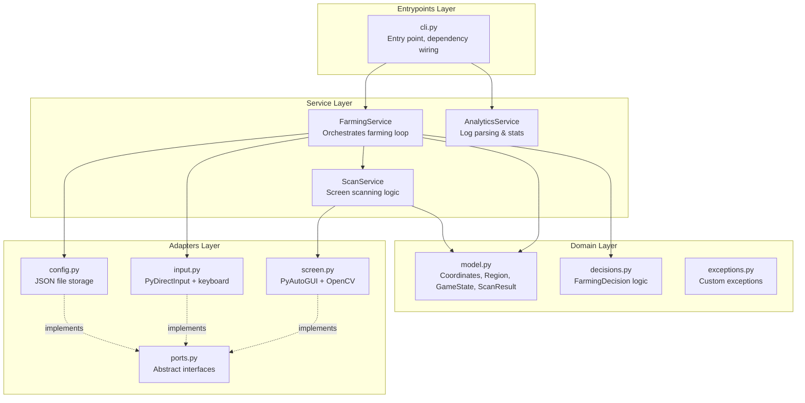
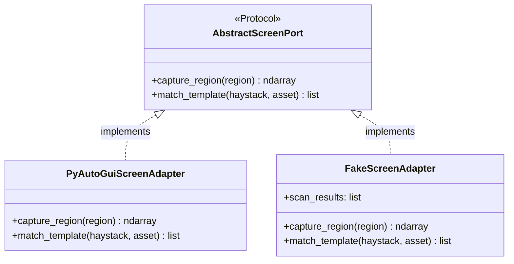
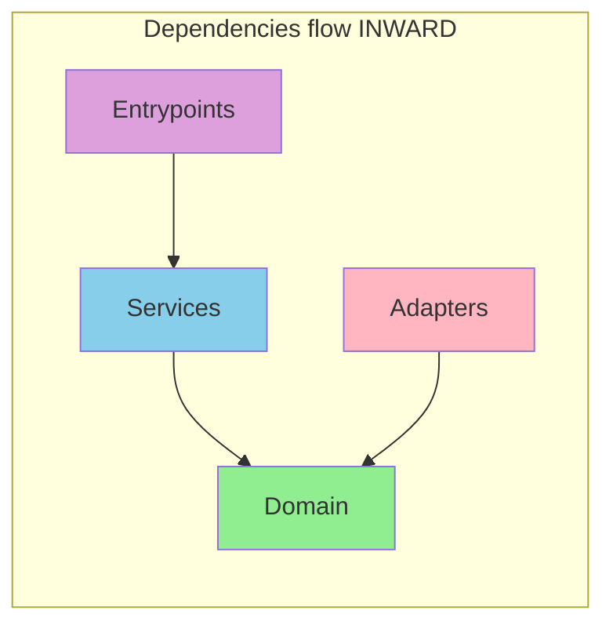

# Balatro Soul Farm - Architecture Guide

This document explains the architecture of the Balatro Soul Farm automation, designed following **Cosmic Python** (Architecture Patterns with Python) principles.

## Overview

The codebase is organized into four distinct layers, each with a single responsibility:



---

## Layer Responsibilities

### 1. Domain Layer (`domain/`)

**Pure business logic with zero dependencies on external systems.**

| File | Contents |
|------|----------|
| `model.py` | Value objects (`Coordinates`, `Region`) and entities (`GameState`, `ScanResult`, `ProfileConfig`) |
| `decisions.py` | `FarmingDecision` enum and `decide_farming_action()` - pure function with no I/O |
| `exceptions.py` | Exception hierarchy (`BalatroError`, `AssetNotFoundError`, etc.) |

**Key principle**: This layer has no `import` statements for external libraries (no pyautogui, cv2, etc.). It can be tested with simple unit tests.

---

### 2. Adapters Layer (`adapters/`)

**Abstractions over external I/O systems (screen, keyboard, files).**

| File | Purpose |
|------|---------|
| `ports.py` | Abstract interfaces using `Protocol` - defines contracts |
| `screen.py` | `PyAutoGuiScreenAdapter` - screen capture and template matching |
| `input.py` | `DirectInputAdapter` - mouse/keyboard control |
| `config.py` | `JsonConfigRepository` - profile persistence |

**Key principle**: All external I/O is behind abstract interfaces. Tests can substitute fake implementations.



---

### 3. Service Layer (`service_layer/`)

**Use cases and orchestration - coordinates domain and adapters.**

| File | Purpose |
|------|---------|
| `farming.py` | `FarmingService` - main automation loop, coordinates all operations |
| `scanning.py` | `ScanService` - multi-ROI scanning and result aggregation |
| `analytics.py` | `AnalyticsService` - log parsing and statistics display |

**Key principle**: Services depend on abstract ports, not concrete implementations. Dependencies are injected via constructor.

---

### 4. Entrypoints Layer (`entrypoints/`)

**Application entry points - wires dependencies together.**

| File | Purpose |
|------|---------|
| `cli.py` | Creates real adapters, injects into services, runs the app |

**Key principle**: This is the only place where concrete implementations are instantiated.

---

## Dependency Flow



- **Domain** depends on nothing
- **Adapters** depend only on Domain (for model types)
- **Services** depend on Domain and Adapter interfaces (ports)
- **Entrypoints** depend on everything (wires it together)

---

## Testing Strategy

| Test Type | What | How |
|-----------|------|-----|
| **Unit (Domain)** | Business logic | Direct function calls, no mocks |
| **Unit (Services)** | Orchestration | Inject fake adapters |
| **Integration** | Real adapters | Test against actual screen/files |

### Example: Testing with Fakes

```python
from tests.fakes import FakeScreenAdapter, FakeInputAdapter, FakeConfigRepository
from balatro.service_layer.farming import FarmingService
from balatro.domain.model import ScanResult, Coordinates

def test_farming_decision():
    # Arrange - inject fakes with controlled data
    fake_screen = FakeScreenAdapter(scan_results=[
        ScanResult("charm.png", Coordinates(500, 500), 0.95, slot=1)
    ])
    fake_input = FakeInputAdapter()
    fake_config = FakeConfigRepository()

    service = FarmingService(fake_screen, fake_input, fake_config)

    # Act
    decision = service.scan_and_decide()

    # Assert
    assert decision == FarmingDecision.SKIP_SLOT_1
```

---

## Adding New Features

### Adding a new adapter (e.g., remote control)

1. Add new protocol methods to `adapters/ports.py` if needed
2. Create `adapters/remote.py` implementing the protocol
3. Update `entrypoints/cli.py` to wire the new adapter

### Adding a new detection target

1. Add asset image to `assets/`
2. Update `adapters/screen.py` threshold config
3. Update `domain/decisions.py` with new decision logic
4. Add tests to `tests/test_decisions.py`

---

## File Reference

```
src/balatro/
├── __init__.py           # Public API exports
├── main.py               # Delegates to CLI
├── process_log.py        # Backward compat shim
│
├── domain/
│   ├── __init__.py
│   ├── model.py          # Coordinates, Region, ScanResult, GameState, ProfileConfig
│   ├── decisions.py      # FarmingDecision, decide_farming_action()
│   └── exceptions.py     # BalatroError hierarchy
│
├── service_layer/
│   ├── __init__.py
│   ├── farming.py        # FarmingService
│   ├── scanning.py       # ScanService
│   └── analytics.py      # AnalyticsService
│
├── adapters/
│   ├── __init__.py
│   ├── ports.py          # AbstractScreenPort, AbstractInputPort, AbstractConfigPort
│   ├── screen.py         # PyAutoGuiScreenAdapter
│   ├── input.py          # DirectInputAdapter
│   └── config.py         # JsonConfigRepository
│
├── entrypoints/
│   ├── __init__.py
│   └── cli.py            # main() - dependency wiring
│
├── assets/               # Image templates for detection
└── config.json           # Resolution profiles
```
